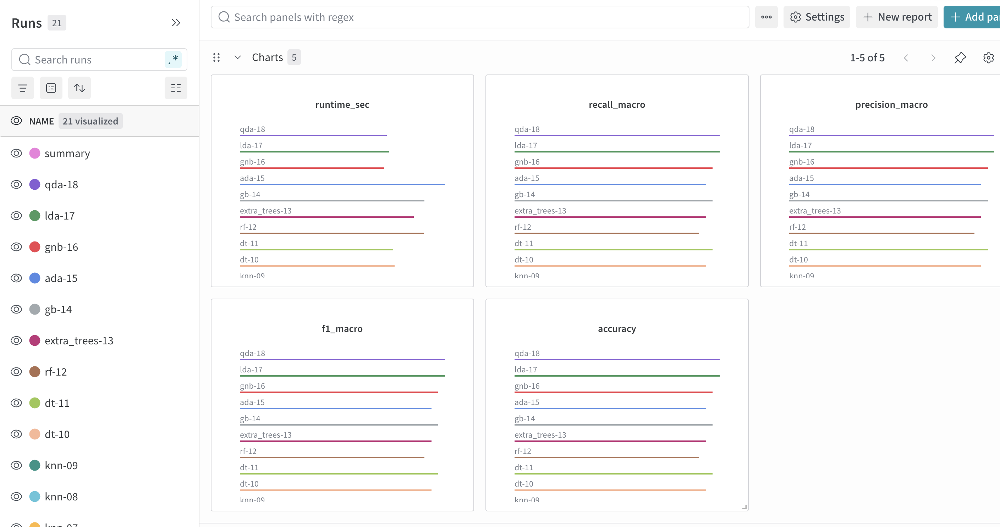
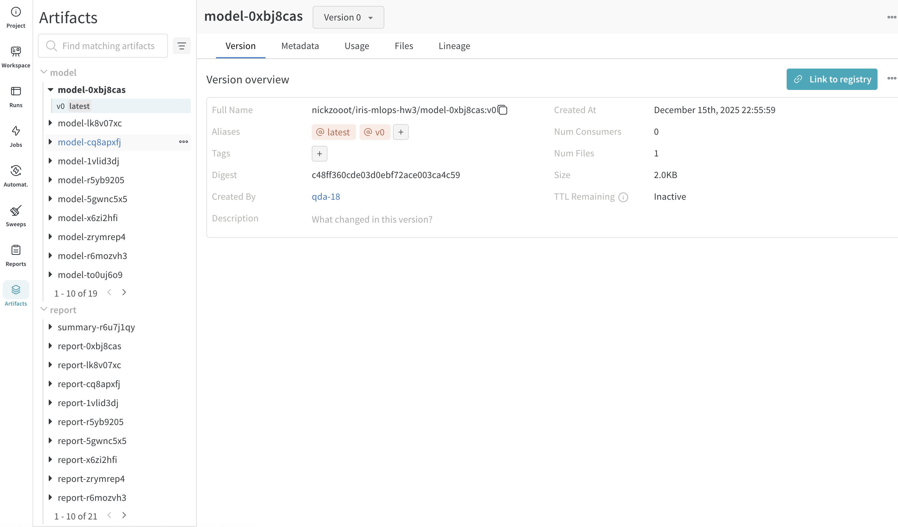

# Отчет: ДЗ 3 — трекинг экспериментов (W&B)

## Коротко
- Инструмент: Weights & Biases (W&B)
- Проект: https://wandb.ai/nickzooot/iris-mlops-hw3
- Основные скрипты: `iris-mlops/scripts/wandb_experiments.py`, `iris-mlops/scripts/wandb_query_runs.py`

## Настройка W&B (4 балла)

### Установка зависимостей
Я ставил зависимости так (pip):
```bash
cd iris-mlops
python -m pip install -e .
```

Если используете окружение проекта через pixi:
```bash
cd iris-mlops
pixi install
```

### Аутентификация
Ключ в репозиторий не кладу.

Вариант A (через env):
```bash
export WANDB_API_KEY="..."
export WANDB_ENTITY="nickzooot"
export WANDB_MODE="online"
```

Вариант B (через CLI, ключ сохраняется локально в `~/.netrc`):
```bash
cd iris-mlops
wandb login
```

Offline режим (чтобы любой мог воспроизвести без аккаунта):
```bash
export WANDB_MODE="offline"
```

### Проект и доступ
- Entity: `nickzooot`
- Project: `iris-mlops-hw3`
- URL: https://wandb.ai/nickzooot/iris-mlops-hw3

### Где хранятся логи
- `online`: всё хранится в W&B Cloud (внутри проекта).
- `offline`: логи пишутся локально в `iris-mlops/wandb/` (папка в `.gitignore`).
  Потом можно загрузить в облако:
  ```bash
  cd iris-mlops
  wandb sync --sync-all ./wandb --entity nickzooot --project iris-mlops-hw3
  ```

## Эксперименты (4 балла)
Скрипт запускает **18 обучающих запусков** + **1 summary‑run** (таблица сравнения).

### Что гонял (алгоритмы/модели)
- `logreg` (3 варианта C)
- `svc` (rbf/linear)
- `knn` (3/5/7)
- `dt` (2 варианта depth)
- `rf`, `extra_trees`, `gb`, `ada`
- `gnb`, `lda`, `qda`

### Запуск offline
```bash
cd iris-mlops
WANDB_SILENT=true python scripts/wandb_experiments.py --mode offline
# [01/18] logreg-01: accuracy=0.8667
# [02/18] logreg-02: accuracy=0.9333
# ...
# [18/18] qda-18: accuracy=1.0000
# Saved summary: .../iris-mlops/reports/hw3/wandb_experiments_summary.csv
```

### Запуск online (в облако W&B)
```bash
cd iris-mlops
WANDB_SILENT=true python scripts/wandb_experiments.py \
  --mode online \
  --entity nickzooot \
  --project iris-mlops-hw3 \
  --group hw3-iris-online
# [01/18] logreg-01: accuracy=0.8667
# ...
# [18/18] qda-18: accuracy=1.0000
```

Факт: в группе `hw3-iris-online` получилось **19 runs** (18 train + 1 summary).

## Логирование (метрики/параметры/артефакты) (4 балла)

### Метрики
- `accuracy`, `f1_macro`, `precision_macro`, `recall_macro`
- `runtime_sec`
- `confusion_matrix` (через `wandb.plot.confusion_matrix`)

### Параметры
В `config` каждого run:
- `model_name`, `model_params`, `needs_scaling`
- `seed`, `test_size`

### Артефакты
- Модель: `iris-mlops/models/wandb/<run_id>/model.joblib`
- Отчет: `iris-mlops/models/wandb/<run_id>/classification_report.json`
- Summary: `iris-mlops/reports/hw3/wandb_experiments_summary.csv` (и логируется в summary‑run)

## Сравнение / фильтрация / поиск (UI + скрипт)

### В W&B UI
- Фильтр по группе: `group = hw3-iris-online`
- Дальше можно сортировать по `accuracy`, открывать runs и сравнивать.

### Через W&B API (скрипт)
```bash
cd iris-mlops
python scripts/wandb_query_runs.py \
  --entity nickzooot \
  --project iris-mlops-hw3 \
  --group hw3-iris-online \
  --min-accuracy 0.95 \
  --top-k 5
# run_id      name           group    state  ... accuracy ... url
# 4g7q6856 logreg-03 hw3-iris-online finished ... 1.000000 ... https://wandb.ai/nickzooot/iris-mlops-hw3/runs/4g7q6856
# 44owkb9s    svc-06 hw3-iris-online finished ... 1.000000 ... https://wandb.ai/nickzooot/iris-mlops-hw3/runs/44owkb9s
```

## Интеграция с кодом (2 балла)
- Контекст‑менеджер для run: `iris-mlops/src/iris_mlops/tracking/wandb_utils.py` → `wandb_run`
- Декоратор автологирования: `iris-mlops/src/iris_mlops/tracking/wandb_utils.py` → `wandb_autolog`
- Утилиты: `log_params`, `log_metrics`, `log_file_artifact`

## Скриншоты (2 балла)




## Чек‑лист
- [x] W&B установлен и настроен (login/project)
- [x] 15+ экспериментов (18 train + summary)
- [x] Логируются метрики/параметры/артефакты
- [x] Есть сравнение/поиск (UI + `wandb_query_runs.py`)
- [x] Интеграция в код (decorator + context manager + utils)
