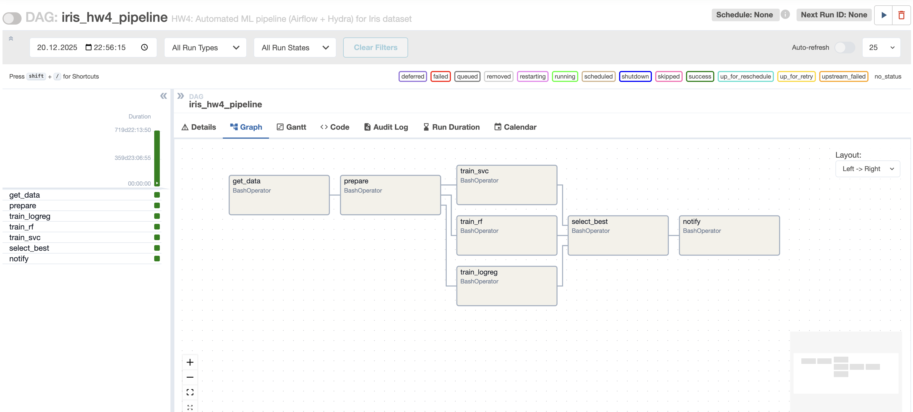
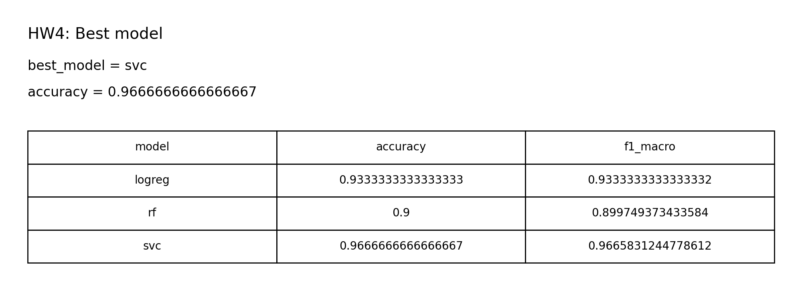

# Отчет: ДЗ 4 — автоматизация ML пайплайнов (Apache Airflow + Hydra)

## Коротко
- Оркестрация: **Apache Airflow**
- Конфигурации: **Hydra** (композиция конфигов + базовая валидация)
- DAG: `iris-mlops/airflow/dags/iris_hw4_pipeline.py`
- Конфиги: `iris-mlops/configs/hw4/`
- Скрипты пайплайна: `iris-mlops/scripts/hw4_*.py`

## 1) Airflow: настройка и workflow (4 балла)

### Установка
Использую **только pixi** (рекомендовано для воспроизводимости и одинакового окружения у менторов):
```bash
cd iris-mlops
pixi install --locked
```

### Инициализация Airflow
Все команды ниже можно выполнять либо в `pixi shell`, либо через `pixi run ...`.

Самый простой вариант — готовые pixi tasks:
```bash
cd iris-mlops
pixi run airflow-init
```

### Workflow и зависимости
DAG `iris_hw4_pipeline` состоит из этапов:
1. `get_data` → генерирует `data/raw/iris.csv`
2. `prepare` → создает `data/processed/hw4/train.csv` и `test.csv`
3. `train_logreg`, `train_rf`, `train_svc` → параллельные ветки, сохраняют модели и метрики
4. `select_best` → выбирает лучшую модель и копирует в `models/hw4/best/model.joblib`
5. `notify` → пишет уведомление в `reports/hw4/notifications.log`

### Кэширование и параллельное выполнение
- Кэширование реализовано на уровне шагов: если выходные файлы уже существуют и `force=false`, шаг печатает `cache hit -> skip` и быстро завершается.
- Параллельность реализована структурой DAG: `train_*` задачи независимы и могут выполняться параллельно (при executor’е Airflow с поддержкой параллелизма, например `LocalExecutor`).

## 2) Hydra: конфиги, композиция, валидация (3 балла)

### Композиция конфигов
Базовый конфиг: `configs/hw4/config.yaml` + группа `configs/hw4/model/*`:
- `model=logreg`
- `model=rf`
- `model=svc`

Пример переопределения:
```bash
cd iris-mlops
pixi run python scripts/hw4_train.py model=rf model.params.n_estimators=500
```

### Валидация
В шагах пайплайна есть базовая проверка параметров (например `data.test_size` в (0,1) и известные `model.name`).

## 3) Интеграция, мониторинг, уведомления, воспроизводимость (2 балла)

### Интеграция
Airflow вызывает шаги пайплайна (скрипты `scripts/hw4_*.py`), которые читают конфиги через Hydra.

### Мониторинг выполнения
- Airflow UI (если запускать webserver) + логи задач.
- Локальный тест без UI: `airflow dags test` (см. ниже).

### Уведомления
Отдельный шаг `notify` пишет результат в `reports/hw4/notifications.log` (без внешних интеграций, чтобы менторы могли воспроизвести).

### Воспроизводимость
- Фиксированный `seed` в конфиге (`configs/hw4/config.yaml`)
- Все артефакты пишутся в предсказуемые пути внутри репозитория (`data/processed/hw4`, `models/hw4`, `reports/hw4`)

## 4) Как запустить (CLI)

### Быстрый прогон DAG без UI 
```bash
cd iris-mlops
pixi run airflow-init
pixi run airflow-test-hw4
```

### Запуск через UI
```bash
cd iris-mlops
pixi run airflow-standalone
```
Дальше открыть UI и запустить DAG `iris_hw4_pipeline`:
- Airflow UI: `http://127.0.0.1:8082` (порт 8080 занят ClearML, поэтому Airflow запускается на 8082)
  - Если открываете через `http://localhost:8082` и в Safari страница пустая/не открывается: используйте `http://127.0.0.1:8082` (часто `localhost` резолвится в IPv6 `::1`, а webserver слушает IPv4).

Чтобы принудительно пересобрать все шаги, триггерить DAG с конфигом:
```json
{"force": true}
```

### Альтернатива без Airflow (быстрый локальный прогон шагов)
```bash
cd iris-mlops
pixi run hw4-run-local
```

## Скриншоты
DAG (схема):


Результат (best model):


## Чек-лист
- [x] Airflow установлен, DAG создан, зависимости между этапами настроены
- [x] Есть кэширование (skip при наличии выходов) и параллельные ветки train-задач
- [x] Hydra конфиги для нескольких моделей + композиция + базовая валидация
- [x] Мониторинг через Airflow логи/UI, уведомления через `reports/hw4/notifications.log`
- [x] Отчет + скриншоты в репозитории
