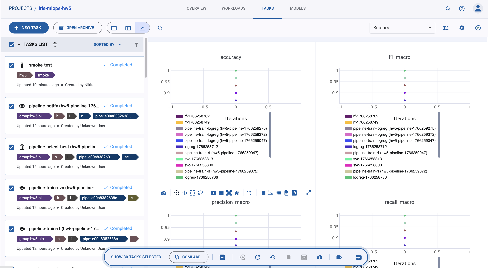
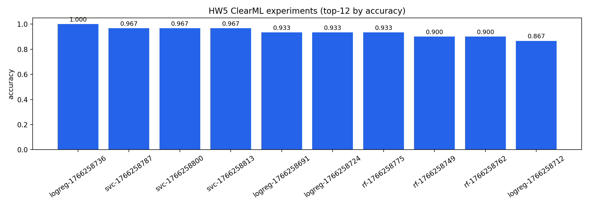
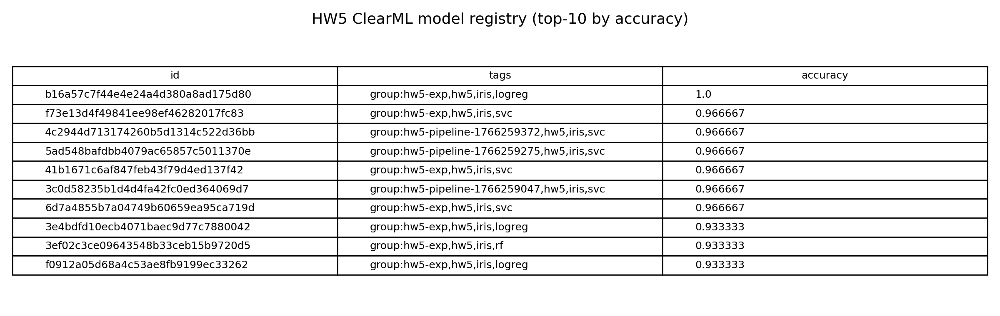

# Отчет: ДЗ 5 — ClearML для MLOps

## Коротко
- Инструмент: **ClearML (Server + Python client)**
- Сервер (docker-compose): `iris-mlops/clearml/docker-compose.yml`
- Эксперименты / трекинг: `iris-mlops/scripts/hw5_clearml_train.py`, `iris-mlops/scripts/hw5_clearml_experiments.py`
- Сравнение экспериментов: `iris-mlops/scripts/hw5_clearml_compare.py`
- Реестр моделей: `iris-mlops/scripts/hw5_clearml_list_models.py`
- Pipeline: `iris-mlops/scripts/hw5_clearml_pipeline.py` (+ scheduler: `iris-mlops/scripts/hw5_clearml_scheduler.py`)

UI по умолчанию:
- Web UI: `http://localhost:8080`
- API: `http://localhost:8008`
- Fileserver: `http://localhost:8081`

---

## 1) Настройка ClearML (3 балла)

### 1.1 ClearML Server (docker-compose)
В проект добавлен `iris-mlops/clearml/docker-compose.yml` с сервисами:
- `mongo` (БД), `elasticsearch` (поиск), `redis` (очереди/кэш)
- `apiserver`, `webserver`, `fileserver`, `async_delete`

Хранилище артефактов и БД лежат локально в `iris-mlops/clearml/.clearml-server/` (папка в `.gitignore`).

Запуск:
```bash
cd iris-mlops/clearml
docker compose --env-file .env.example -f docker-compose.yml up -d
curl -s http://localhost:8008/debug.ping
```

### 1.2 Аутентификация (API keys)
Для воспроизводимости используются **локальные** ключи из `iris-mlops/clearml/.env.example`.
Они не дают доступ никуда наружу (сервер локальный), поэтому их можно использовать как “учебные”.

Экспорт переменных окружения (для запуска скриптов):
```bash
export CLEARML_API_HOST="http://localhost:8008"
export CLEARML_WEB_HOST="http://localhost:8080"
export CLEARML_FILES_HOST="http://localhost:8081"
export CLEARML_API_ACCESS_KEY="hw5_local_access"
export CLEARML_API_SECRET_KEY="hw5_local_secret"
```

### 1.3 Установка клиента
```bash
cd iris-mlops
pixi install --locked
```

Smoke-check подключения:
```bash
cd iris-mlops
pixi run hw5-smoke
```

---

## 2) Трекинг экспериментов (3 балла)

### 2.1 Автологирование + параметры/метрики
В `iris-mlops/scripts/hw5_clearml_train.py`:
- создаётся `Task` в проекте `iris-mlops-hw5`
- конфиг (Hydra) подключается в `Task` как hyperparameters (`task.connect(..., name="cfg")`)
- метрики логируются через `logger.report_scalar(...)` (accuracy, f1_macro, precision_macro, recall_macro)
- confusion matrix логируется как matplotlib figure (`report_matplotlib_figure`)
- артефакты (`metrics`, `classification_report`) загружаются через `task.upload_artifact(...)`

### 2.2 Система сравнения экспериментов
Генерация набора экспериментов (9 запусков):
```bash
cd iris-mlops
pixi run hw5-experiments
```

Сравнение (top-k):
```bash
cd iris-mlops
pixi run hw5-compare
```
Скрипт сохраняет сводку в `reports/hw5/clearml_experiments_summary.csv` (папка `reports/hw5` gitignored; данные остаются в ClearML).

### 2.3 Дашборды
В UI ClearML доступны:
- графики scalar’ов (metrics)
- сравнение runs
- просмотр артефактов (confusion matrix, отчеты, json/csv)

---

## 3) Управление моделями (3 балла)

### 3.1 Регистрация и “версии”
Каждый запуск `hw5_clearml_train.py` создает `OutputModel` и регистрирует веса через `update_weights(...)`.
Имя модели: `iris-hw5-classifier`, теги включают модель и группу (например `group:hw5-exp`).

### 3.2 Метаданные модели
В метаданные записываются:
- `model_name`, `seed`, `test_size`
- `accuracy` (отдельным полем)
- `metrics_json` (полная метрика-структура)

Список моделей:
```bash
cd iris-mlops
pixi run hw5-list-models
```

---

## 4) Пайплайны (2 балла)
### 4.1 ClearML Pipeline (локальное выполнение, без агента)
Pipeline реализован через `PipelineController` в `iris-mlops/scripts/hw5_clearml_pipeline.py`.
Шаги:
- `train_logreg`, `train_rf`, `train_svc`
- `select_best` (выбор лучшего по accuracy внутри pipeline-run группы)
- `notify` (уведомление в `reports/hw5/notifications.log`)

Запуск:
```bash
cd iris-mlops
pixi run hw5-pipeline
```

Мониторинг выполнения:
- в терминале (логи)
- в UI: страница pipeline + задачи шагов

### 4.2 Автоматический запуск
Добавлен пример “планировщика” на базе `TaskScheduler` (UTC):
```bash
cd iris-mlops
pixi run hw5-scheduler-hourly
```
Для демо без долгоживущего процесса:
```bash
cd iris-mlops
pixi run hw5-scheduler
```

---

## 5) Скриншоты (1 балл)

Эксперименты (top-12 accuracy):


Реестр моделей (top-10 accuracy):


Pipeline summary:

