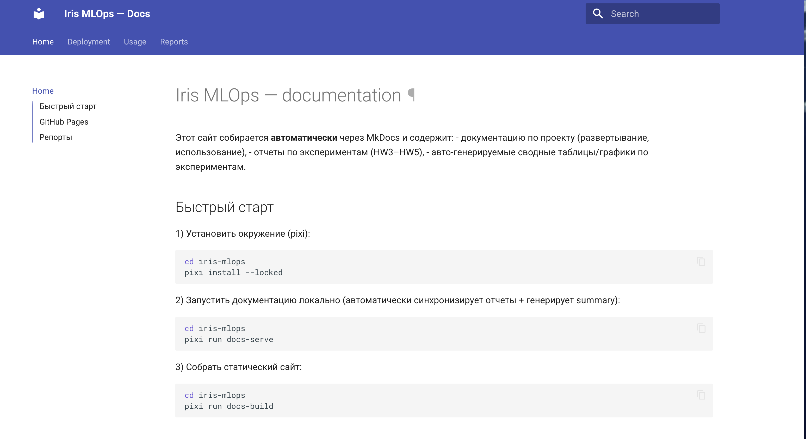
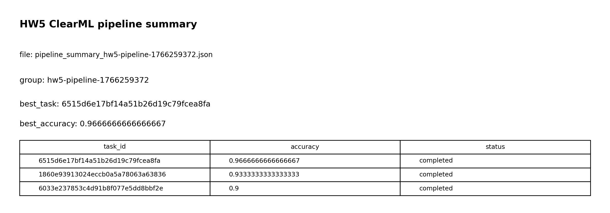

# Отчет: ДЗ 6 — документация и отчеты (MkDocs + GitHub Pages)

## Коротко
- Документация: **MkDocs + mkdocs-material**
- Источник документации: `iris-mlops/docs/` + `iris-mlops/mkdocs.yml`
- Автогенерация страниц/отчетов: `iris-mlops/scripts/hw6_generate_docs.py`
- Публикация: **GitHub Pages** через workflow `.github/workflows/docs.yml`

---

## 1) Техническая документация (2 балла)

### Страницы документации
- Главная: `docs/index.md`
- Руководство по развертыванию: `docs/deployment.md`
- Примеры использования: `docs/usage.md`
- Страница отчетов: `docs/reports/index.md`

### Сборка локально
Использую **только pixi**:
```bash
cd iris-mlops
pixi install --locked
pixi run docs-serve
```

---

## 2) Публикация в GitHub Pages (3 балла)

Workflow: `.github/workflows/docs.yml`
- триггерится на `push` в `main`
- ставит pixi, делает `pixi install`, затем `pixi run docs-build`
- деплоит артефакт на GitHub Pages

Важно: в репозитории нужно включить Pages:
`Settings → Pages → Source: GitHub Actions`.

---

## 3) Отчеты об экспериментах (2 балла)

### Синхронизация отчетов
Каноничные отчеты лежат в `reports/*.md` и перед сборкой docs автоматически копируются в `docs/reports/*.md`
с переписыванием ссылок на картинки.

### Автогенерируемая сводка (таблицы + графики)
Скрипт `scripts/hw6_generate_docs.py` генерирует:
- `docs/reports/experiments_generated.md`
- графики в `docs/assets/generated/` (bar charts)

Источники данных:
- HW3: `reports/hw3/wandb_experiments_summary.csv`
- HW4: `reports/hw4/metrics_*.json` + `reports/hw4/summary.json`
- HW5: `reports/hw5/clearml_experiments_summary.csv` (если файл есть локально)

---

## 4) Воспроизводимость (1 балл)

Минимальный сценарий для проверки HW6:
```bash
cd iris-mlops
pixi install --locked
pixi run docs-build
```

---

## Скриншоты (результаты из отчетов, доступные в docs)
MkDocs:

W&B:


Airflow DAG:


ClearML Pipeline:


---

## Чек-лист
- [x] MkDocs настроен (`mkdocs.yml`, `docs/*`)
- [x] Автогенерация страниц/таблиц/графиков (`scripts/hw6_generate_docs.py`)
- [x] GitHub Actions публикация на GitHub Pages (`.github/workflows/docs.yml`)
- [x] Инструкции по воспроизведению добавлены
